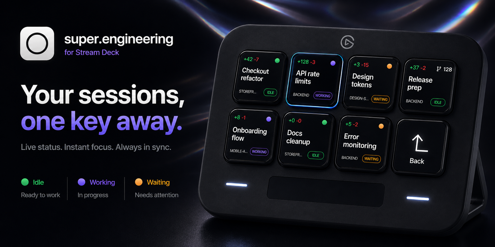
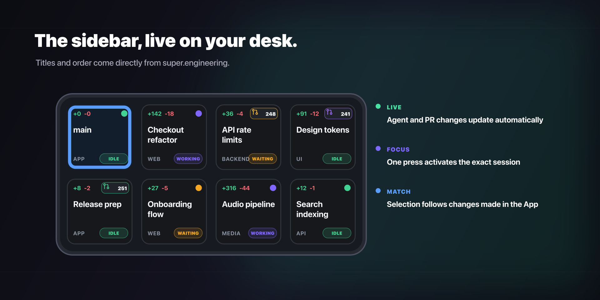
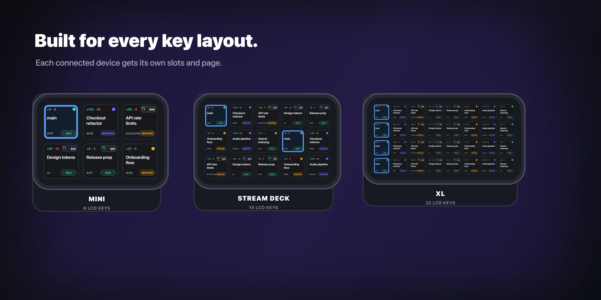
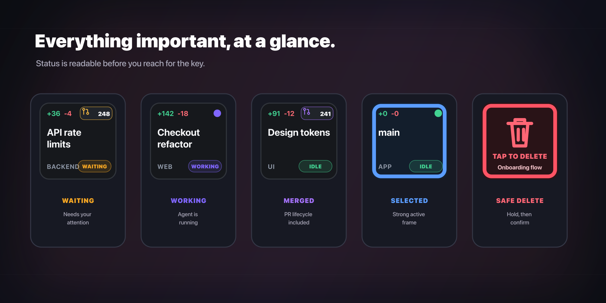

<div align="center">
  
  <h1>super.engineering for Stream Deck</h1>
  <p>See, focus, and safely clean up your super.engineering sessions without leaving the keyboard.</p>
  <p>
    <a href="https://github.com/freak4pc/streamdeck-super-engineering/releases/latest"></a>
    <a href="https://github.com/freak4pc/streamdeck-super-engineering/actions/workflows/ci.yml"></a>
    
    
    <a href="LICENSE"></a>
  </p>
  <p>
    <a href="https://github.com/freak4pc/streamdeck-super-engineering/releases/latest"><strong>Download</strong></a>
    ·
    <a href="#setup"><strong>Setup</strong></a>
    ·
    <a href="https://github.com/freak4pc/streamdeck-super-engineering/issues"><strong>Support</strong></a>
  </p>
</div>



Your Stream Deck becomes a live, physical view of the super.engineering sidebar. Keys stay in the
same visible order, update as agents change state, and show the information that matters before you
reach for them.

| Live sessions | Instant focus | At-a-glance context | Safe cleanup |
| --- | --- | --- | --- |
| Titles, order, selection, and state mirror the app. | Press a key to activate the exact session and focus super.engineering. | See project, Git diff, agent state, and pull request status. | Hold to arm deletion, then press again to confirm. |



## Install

1. Download the latest `.streamDeckPlugin` from
   [Releases](https://github.com/freak4pc/streamdeck-super-engineering/releases/latest).
2. Open the downloaded file and approve installation in Stream Deck.
3. Open super.engineering, then follow the setup below.

## Setup

1. Create or open the Stream Deck profile where you want your sessions.
2. Drag **Session Slot** onto every LCD key you want to dedicate to sessions.
3. Optionally add **Next Sessions**, **Previous Sessions**, **Open Sessions**, and **Back**.
4. Select **Open Sessions** in Stream Deck to verify the connection and adjust advanced paths.

Visible Session Slot actions are grouped independently for each connected device and sorted by their
physical row and column. That makes arbitrary layouts and simultaneous devices work without
device-specific configuration.

| Device | Suggested layout |
| --- | --- |
| Stream Deck Mini | 5 session slots + Next |
| Stream Deck | 12 session slots + Previous + Next + Back |
| Stream Deck Neo / Stream Deck + | 6 session slots + Next + Back |
| Stream Deck XL | 29 session slots + Previous + Next + Back |

**Next Sessions** and **Previous Sessions** wrap around when there is more than one page. Pagination
is retained separately for every connected Stream Deck.



## Actions

| Action | What it does |
| --- | --- |
| **Session Slot** | Displays and activates the corresponding sidebar session. Hold for 700 ms to arm safe worktree deletion, then tap the red confirmation key within five seconds. |
| **Open Sessions** | Opens or focuses super.engineering and refreshes the grid. Its property inspector contains connection diagnostics and global settings. |
| **Previous Sessions / Next Sessions** | Pages through sessions when the sidebar contains more rows than the visible Session Slot keys. |
| **Back** | Returns to the previously active Stream Deck profile. |

Deletion delegates to `sc worktree delete` without `--force`. super.engineering rejects primary,
dirty, or unpushed worktrees and leaves the Git branch intact.



## Requirements

- macOS 14 or newer
- Stream Deck 7.1 or newer
- super.engineering with `sc` API v21 or newer
- Optional: an authenticated [GitHub CLI](https://cli.github.com) for live CI check colors

The plugin uses only public Stream Deck SDK APIs and does not access user-created profiles.

## Device support

The grid adapts at runtime to any keypad size exposed by the Stream Deck app. It is designed for
Stream Deck Mini, Stream Deck, Stream Deck XL, Stream Deck Mobile, Stream Deck +, Stream Deck Neo,
Virtual Stream Deck, Galleon 100 SD, and Stream Deck + XL.

Stream Deck Studio is not supported because it runs through Companion rather than Stream Deck app
profiles. Pedal, keyboard G-keys, and controller G-keys can invoke actions, but are not useful for
the plugin's visual session grid.

## How it works

- `sc status --json` verifies compatibility.
- `sc workspace list --json` supplies sidebar hierarchy, visibility, order, titles, selection, agent
  state, diffs, PR lifecycle, and nested sessions.
- `sc workspace watch --json` triggers live updates. A configurable fallback poll resynchronizes
  after missed events or app restarts.
- `sc worktree select <item-id> --activate --json` activates the exact session.
- `sc worktree delete <item-id> --json` performs safe deletion.
- The GitHub CLI is used only for open-PR check rollups. The rest of the plugin works without it.

The plugin caches rendered key images and updates only keys whose output changed. Watch events are
coalesced to stay within Stream Deck's update-rate guidance.

## Privacy

Everything runs locally. The plugin contains no telemetry, advertising, or analytics, and does not
send session data to the author. See [PRIVACY.md](PRIVACY.md) for details.

## Development

```sh
npm ci
npm run check
npm run watch
```

Link the working directory once:

```sh
npx streamdeck link com.freak4pc.super-engineering.sdPlugin
```

Build a validated installer:

```sh
npm run pack
```

The artifact is written to `dist/`. See [RELEASE.md](RELEASE.md) for the complete release checklist.

## License

[MIT](LICENSE)
